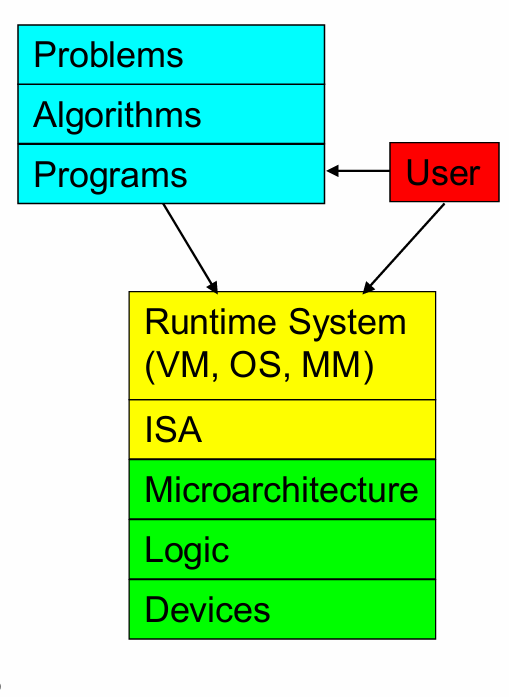

# Nand-to-Tetris
課程網站：https://www.nand2tetris.org/

課程：https://www.coursera.org/learn/build-a-computer/home/welcome

Nand2Tetris IDE Online :https://nand2tetris.github.io/web-ide/chip

---
## 課程簡介
此課程目標是建造一台計算機；從Logic(Nand)開始，逐步設計Microarchitecture、ISA、OS及Algorithm，最終實現運作簡單的俄羅斯方塊小遊戲。

## 章節簡介
### Lecture 1
#### Ideal
- All Boolean functions can implementation by  not、and
- not、and can combine to nand，so we use nand for implement

For example:
(a or b) => not not(a or b) => not(not a and not b)
not => (a nand a)

Hint: Think from Proposition Logic!!